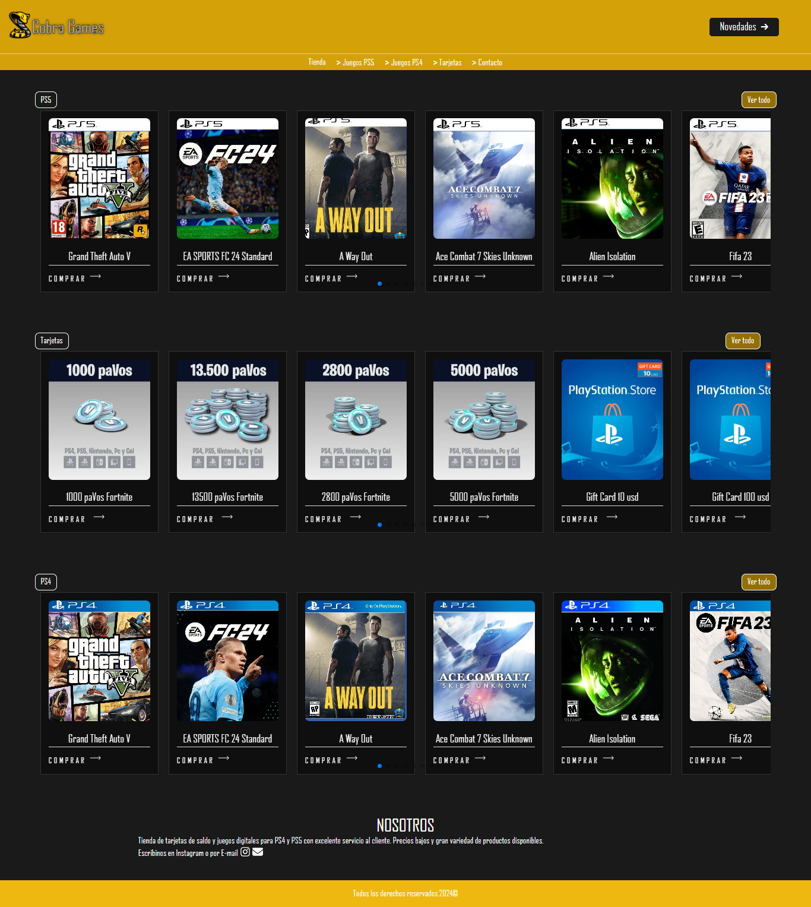
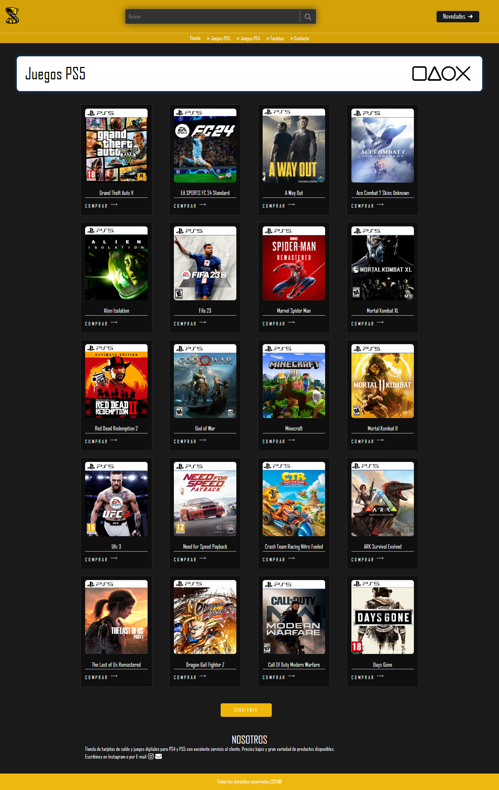
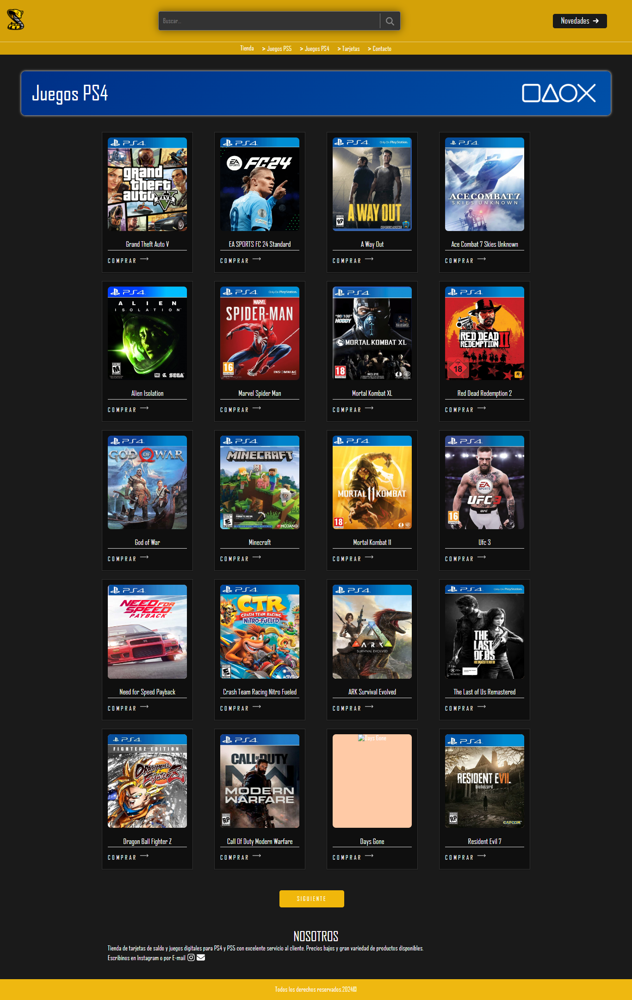
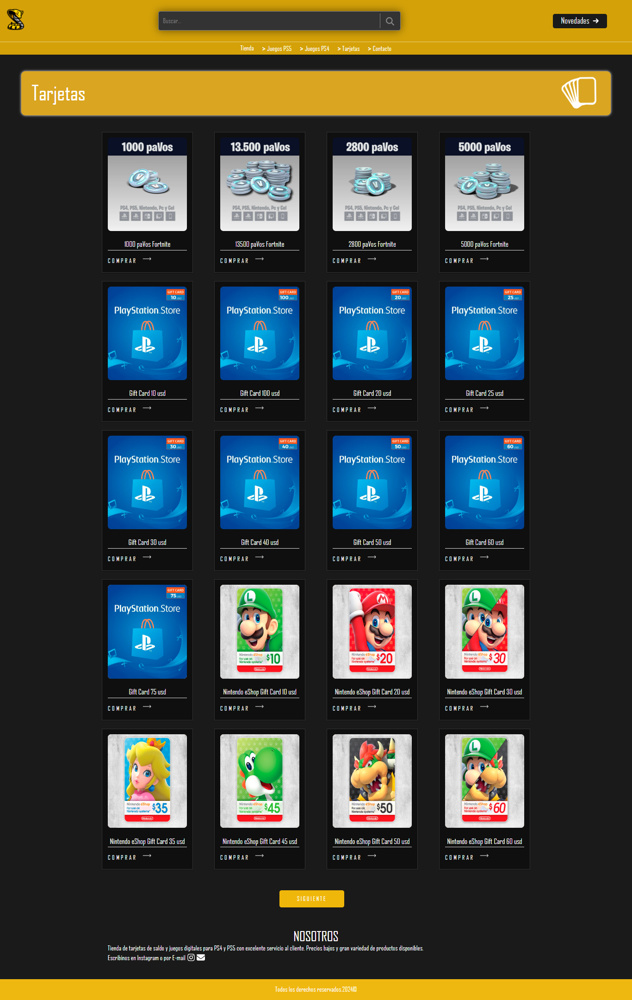
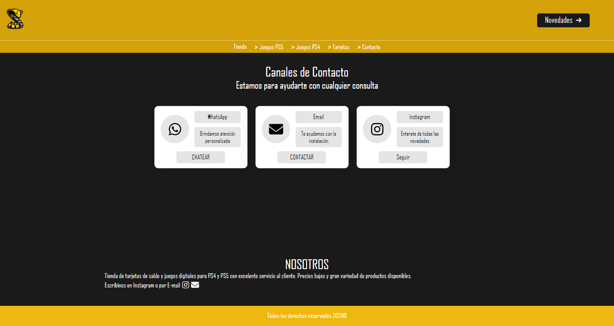

Cobra Games

    Cobra Games es un E-Commerce, una tienda virtual dedicada a la venta de videojuegos digitales para plataformas PS4 y PS5.

///Descripción\\\

    Este proyecto permite a los usuarios navegar y comprar videojuegos digitales para PS4 y PS5 de manera rápida y segura.

///Requisitos Previos\\\

Antes de comenzar, asegúrate de tener instalados los siguientes requisitos:

    * Node.js
    * npm (se instala automáticamente con Node.js)

///Instalación\\\

Para iniciar el proyecto localmente, sigue estos pasos:

Clona el repositorio:

    * git clone https://github.com/tu-usuario/cobra-games.git

Navega al directorio del proyecto:

    * cd cobra-games

Instala las dependencias necesarias:

    * npm install

///Instrucciones de Uso\\\

Una vez que las dependencias estén instaladas, puedes iniciar el proyecto en modo de desarrollo:

    * npm start

Esto abrirá la aplicación en tu navegador en http://localhost:3000.

///Características Principales\\\

Listado de videojuegos digitales para PS4 y PS5.
Posibilidad de comprar juegos digitales directamente a través de la página.

Despliegue

Cobra Games está desplegado en Netlify. Puedes visitar el sitio en vivo en: https://cobragames.com.ar/

///Capturas de Pantalla\\\

///Contribución\\\

Si deseas contribuir al proyecto, no dudes en enviar un pull request.

///Licencia\\\

Este proyecto está licenciado bajo la GNU General Public License v3.0. Para más detalles, consulta el archivo LICENSE.

//Contacto\\\

Para preguntas o sugerencias, puedes contactarnos en alansuarez641@hotmail.com.
